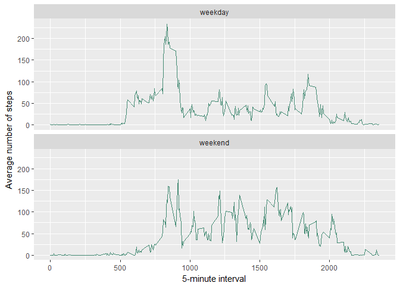

## Loading and preprocessing the data
1.Load the data

```r
unzip ("activity.zip", exdir="data")
if (file.exists("data/activity.csv"))
   activity <- read.csv("data/activity.csv")
```


## What is mean total number of steps taken per day?
1.Calculate the total number of steps taken per day

```r
totalperday <- aggregate(steps ~ date, activity, sum, na.action=na.omit)
```

2.Make a histogram of the total number of steps taken each day

```r
hist(totalperday$steps,
     xlab="Total number of steps each day",
     main="Histogram of the total number of steps taken each day")
```

<!-- -->

3.Calculate and report the mean and median of the total number of steps taken per day

```r
meansteps <- mean(totalperday$steps)
mediansteps <- median(totalperday$steps)
```
The mean of the total number of steps taken per day is ``10766.19``.
The median of the total number of steps taken per day is ``10765.00``.


## What is the average daily activity pattern?
1.Make a time series plot of the 5-minute interval (x-axis) and the average number of steps taken, averaged across all days (y-axis)

```r
avebyint <- aggregate(steps ~ interval, activity, mean, na.action=na.omit)
plot(avebyint$interval, avebyint$steps, type="l",
     xlab="5-minute interval",ylab="Average number of steps")
```

<!-- -->

2.Which 5-minute interval, on average across all the days in the dataset, contains the maximum number of steps?

```r
temp_df <- avebyint[which.max(avebyint$steps),]
maxint <- temp_df$interval
```
The ``835`` 5-minute interval coantains the maximum number of steps.

## Imputing missing values
1.Calculate and report the total number of missing values in the dataset

```r
temp_v <- complete.cases(activity)
missing<- length(temp_v[temp_v==FALSE])
```
There are ``2304`` missing values in the dataset.

2.Devise a strategy for filling in all of the missing values in the dataset: use the mean for that 5-minute interval. Create a new dataset that is equal to the original dataset but with the missing data filled in.

```r
new_activity <- activity
new_activity$steps[is.na(new_activity$steps)]<-avebyint$steps[avebyint$interval==new_activity$interval[is.na(new_activity$steps)]]
```

4.Make a histogram of the total number of steps taken each day and Calculate and report the mean and median total number of steps taken per day.

```r
new_totalperday <- aggregate(steps ~ date, new_activity, sum)
hist(new_totalperday$steps,
     xlab="Total number of steps each day",
     main="Histogram of the total number of steps taken each day")
```

<!-- -->

```r
new_meansteps <- mean(new_totalperday$steps)
new_mediansteps <- median(new_totalperday$steps)
```
The new mean of the total number of steps taken per day is ``10766.19``.
The new median of the total number of steps taken per day is ``10765.59``.


## Are there differences in activity patterns between weekdays and weekends?
1.Create a new factor variable in the dataset with two levels - "weekday" and "weekend" indicating whether a given date is a weekday or weekend day.

```r
new_activity$date <- strptime(as.character(new_activity$date),format="%Y-%m-%d")
new_activity$day <- ifelse(grepl("S(at|un)",weekdays(new_activity$date,abbr=TRUE)),"weekend","weekday")
```

2.Make a panel plot containing a time series plot (i.e. type = "l") of the 5-minute interval (x-axis) and the average number of steps taken, averaged across all weekday days or weekend days (y-axis).

```r
new_avebyint <- aggregate(steps ~ interval+day, new_activity, mean)
library(ggplot2)
ggplot(new_avebyint, aes(interval,steps))+
       geom_line(color="aquamarine4")+
       facet_wrap(~day,nrow=2)+
       xlab("5-minute interval")+
       ylab("Average number of steps")
```

<!-- -->
